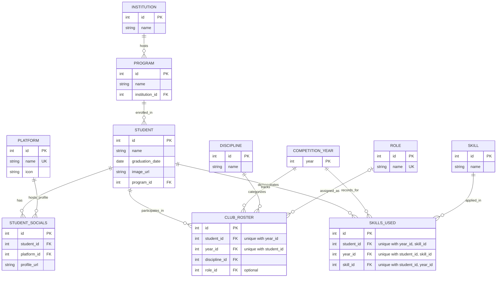

# Members

Members of the club

```mermaid
erDiagram
    INSTITUTION ||--o{ PROGRAM : "hosts"
    PROGRAM ||--o{ STUDENT : "enrolled_in"
    STUDENT ||--o{ STUDENT_SOCIALS : "has"
    PLATFORM ||--o{ STUDENT_SOCIALS : "hosts_profile"
    STUDENT ||--o{ CLUB_ROSTER : "participates_in"
    STUDENT ||--o{ SKILLS_USED : "demonstrates"
    
    COMPETITION_YEAR ||--o{ CLUB_ROSTER : "tracks"
    COMPETITION_YEAR ||--o{ SKILLS_USED : "records_for"
    
    DISCIPLINE ||--o{ CLUB_ROSTER : "categorizes"
    ROLE |o--o{ CLUB_ROSTER : "assigned_as"
    SKILL ||--o{ SKILLS_USED : "applied_in"

    INSTITUTION {
        int id PK
        string name
    }

    PROGRAM {
        int id PK
        string name
        int institution_id FK
    }

    STUDENT {
        int id PK
        string name
        date graduation_date
        string image_url
        int program_id FK
    }

    STUDENT_SOCIALS {
        int id PK
        int student_id FK
        int platform_id FK
        string profile_url
    }

    PLATFORM {
        int id PK
        string name UK
        string icon
    }

    DISCIPLINE {
        int id PK
        string name
    }

    COMPETITION_YEAR {
        int year PK
    }

    CLUB_ROSTER {
        int id PK
        int student_id FK "unique with year_id"
        int year_id FK "unique with student_id"
        int discipline_id FK
        int role_id FK "optional"
    }

    ROLE {
        int id PK
        string name UK
    }

    SKILL {
        int id PK
        string name
    }

    SKILLS_USED {
        int id PK
        int student_id FK "unique with year_id, skill_id"
        int year_id FK "unique with student_id, skill_id"
        int skill_id FK "unique with student_id, year_id"
    }

```
