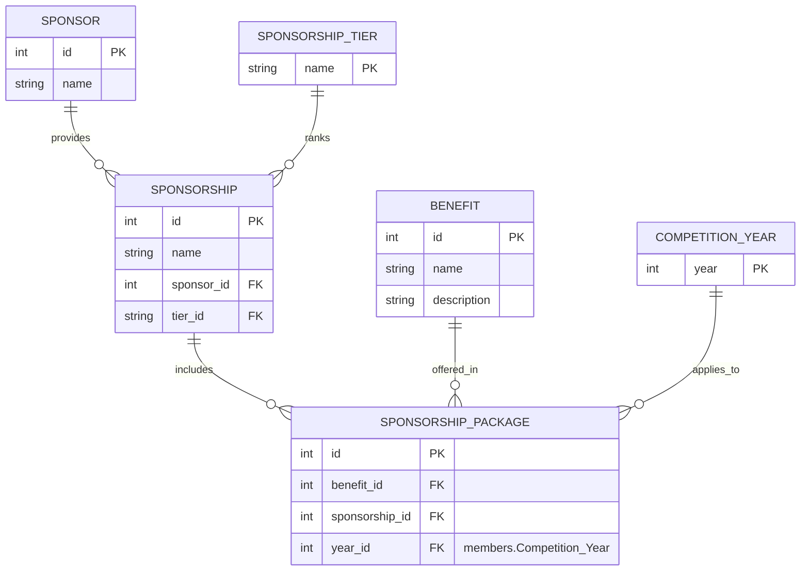

# Club Sponsorship App

Sponsors of the club, their sponsorships, and the benefits included each competition year

```mermaid
erDiagram
    SPONSOR ||--o{ SPONSORSHIP : "provides"
    SPONSORSHIP_TIER ||--o{ SPONSORSHIP : "ranks"
    SPONSORSHIP ||--o{ SPONSORSHIP_PACKAGE : "includes"
    BENEFIT ||--o{ SPONSORSHIP_PACKAGE : "offered_in"
    COMPETITION_YEAR ||--o{ SPONSORSHIP_PACKAGE : "applies_to"

    SPONSORSHIP_TIER {
        string name PK
    }

    BENEFIT {
        int id PK
        string name
        string description
    }

    SPONSOR {
        int id PK
        string name
    }

    SPONSORSHIP {
        int id PK
        string name
        int sponsor_id FK
        string tier_id FK
    }

    SPONSORSHIP_PACKAGE {
        int id PK
        int benefit_id FK
        int sponsorship_id FK
        int year_id FK "members.Competition_Year"
    }

    COMPETITION_YEAR {
        int year PK
    }

```
